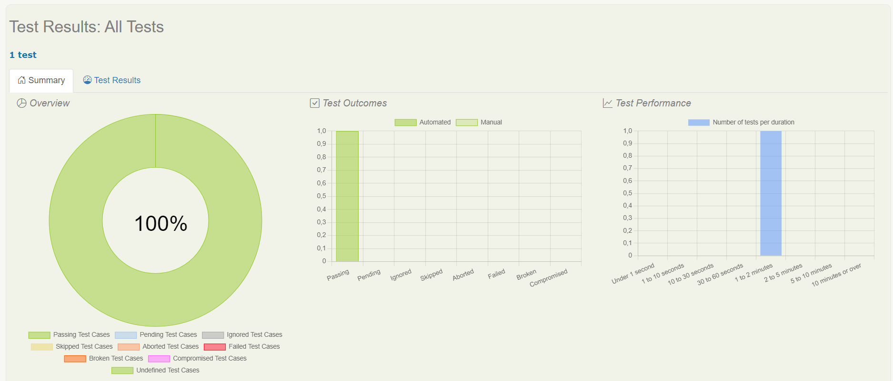
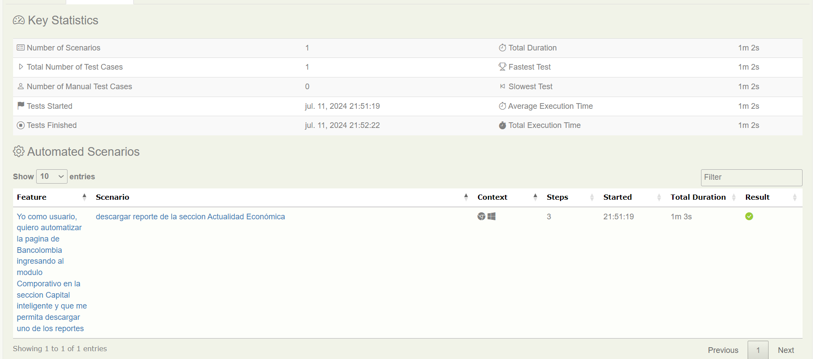

Skill Hacking Banistmo - Reto Técnico de Automatización

Detalles del Proyecto:
Tras descargar las indicaciones del reto técnico en formato PDF, se procedió con un análisis detallado y una ejecución manual completa del flujo para comprender el comportamiento de la aplicación web que sería automatizada. Con estos insights, comenzó la fase de construcción del proyecto.

Para esta automatización, se optó por utilizar Java con Gradle versión 4.13.2 y se implementó el patrón de diseño Screenplay. A continuación se detallan los componentes principales del proyecto:

- Archivo (.feature): Se definió el escenario a automatizar.

- Tasks: Se crearon todas las tareas o acciones necesarias para guiar el flujo de la automatización:
    - IngresarBancolombia: Redirige al aplicativo web.
    - IngresarAlMenu: Permite navegar por el menú principal y seleccionar la opción requerida.
    - IrReporteSeleccionado: Descarga el reporte especificado.

- Userinterface: Se llevó a cabo el mapeo de los selectores esenciales para la automatización de cada página.

- Interactions: Se desarrolló una clase para facilitar la navegación a nuevas pestañas y continuar con el flujo de automatización, debido a limitaciones que impedían hacerlo de forma directa.

- Questions: Se finalizó con la validación del PDF descargado.

Además, se utilizaron los siguientes comandos Git para gestionar el repositorio del proyecto:

```
git init
git add README.md
git commit -m "first commit"
git branch -M main
git remote add origin https://github.com/RodriguezEliecer/Skill_Hacking_Banistmo_Entregable2.git
git push -u origin main
```

Se destaca que en algunas acciones fue necesario agregar tiempos de espera, debido a la carga lenta e intermitente de las páginas, como se mencionó previamente.



